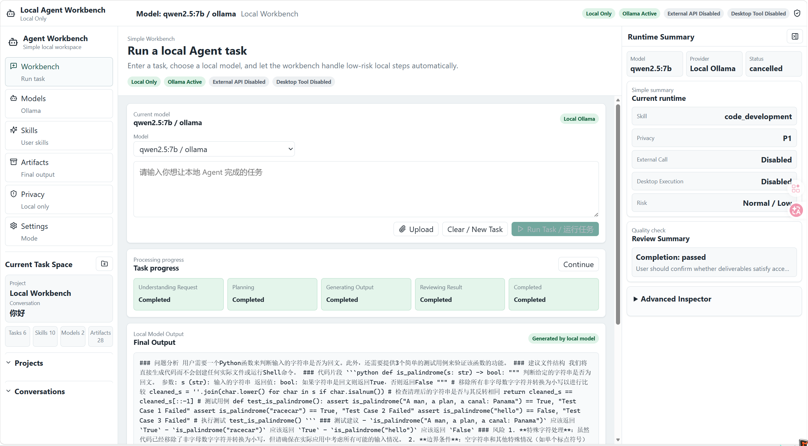
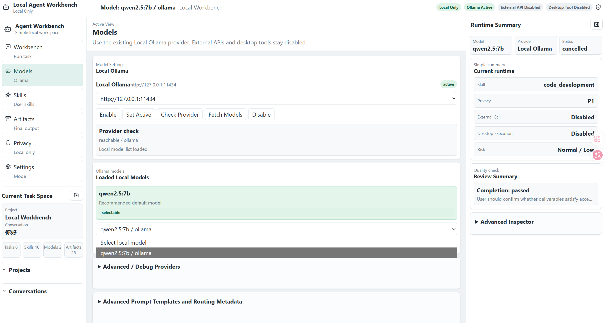
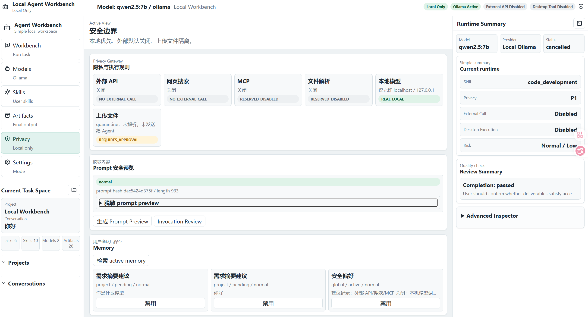
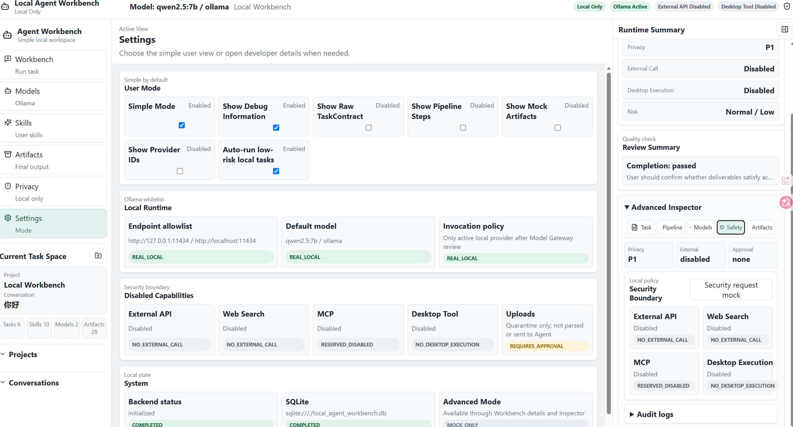

# Local Agent Workbench

A privacy-first local AI agent workbench powered by Ollama.

Local Agent Workbench is a local-first, privacy-first Agent Workbench for running controlled local AI workflows. It combines a model gateway, skill routing, task contracts, a review loop, and an advanced developer inspector into a small runnable v0.1.0 demo.

It is not a cloud API proxy, not a desktop automation runner, and not a general web-search agent. The default path is local execution through FastAPI, SQLite, React, and a user-enabled localhost Ollama provider.

## Screenshots

### Simple Workbench



### Local Ollama Models



### Privacy Boundary



### Developer Details



## Project Positioning

- local-first: app state, task records, and runtime metadata are stored locally.
- privacy-first: uploaded files stay quarantined and are not parsed automatically.
- model gateway: model access is routed through provider allowlists and safety review.
- skill routing: tasks can be mapped to metadata-only skills and pipelines.
- task contract: user requests become explicit objectives, outputs, constraints, and steps.
- review loop: generated outputs can be reviewed before completion.
- advanced developer inspector: runtime details, model routing, safety status, and artifacts are available when needed.

## Features

- Simple Workbench for task input, model selection, progress, final output, and review summary.
- Local Ollama provider with localhost-only endpoint allowlist.
- `qwen2.5:7b` as the default recommended local model.
- TaskContract records with objective, inputs, outputs, constraints, acceptance criteria, and steps.
- Privacy Guard with payload scanning, redaction, local-only boundaries, and quarantined uploads.
- Review Summary for completion and risk feedback.
- Advanced Developer Inspector for task details, pipeline steps, model routing, safety state, and artifacts.

## Quick Start

### 1. Install Ollama

Install Ollama from the official Ollama distribution for your operating system, then start it locally.

Pull the recommended local model:

```powershell
ollama pull qwen2.5:7b
```

### 2. Start the backend

From the project root:

```powershell
cd E:\codex\local-agent-workbench\backend
..\agentwork\Scripts\python.exe -m pip install -r requirements.txt
..\agentwork\Scripts\python.exe -m uvicorn app.main:app --reload --host 127.0.0.1 --port 8000
```

Do not bind the backend to `0.0.0.0` for this MVP.

### 3. Start the frontend

Open another terminal:

```powershell
cd E:\codex\local-agent-workbench\frontend
npm ci
npm run dev -- --host 127.0.0.1 --port 5173
```

Open:

```text
http://127.0.0.1:5173
```

### 4. Enable Local Ollama in the UI

1. Open Providers.
2. Confirm the `Local Ollama` provider exists.
3. Click Enable.
4. Click Set Active.
5. Click Fetch Models.
6. Select `qwen2.5:7b` if available.

If Ollama is not running, the UI should show a readable local model loading error instead of crashing.

## Local-only Security Model

- No external API by default.
- No desktop execution.
- No MCP execution.
- No shell execution from the workbench.
- No uploaded file execution.
- No automatic uploaded file parsing.
- Model invocation logs store prompt hashes, lengths, risk levels, and findings, not full sensitive prompts or full responses.
- Local model calls are restricted to localhost Ollama endpoints:
  - `http://127.0.0.1:11434`
  - `http://localhost:11434`

## Project Structure

```text
local-agent-workbench/
  backend/                 FastAPI app, SQLite models, orchestrator, security, model gateway
  frontend/                React + Vite + TypeScript UI
  skills/                  metadata-only skill packages
  docs/                    architecture, privacy design, roadmap, screenshots
  examples/tasks/          example task inputs for the MVP
  AGENTS.md                project operating rules for coding agents
  SECURITY.md              security guidance
  THREAT_MODEL.md          trust boundaries and known risks
```

## Run Verification

Backend import check from `backend/`:

```powershell
..\agentwork\Scripts\python.exe -B -c "from app.main import app; print('backend ok')"
```

Backend smoke test from `backend/`:

```powershell
..\agentwork\Scripts\python.exe -B scripts\smoke_test.py
```

Frontend production build from `frontend/`:

```powershell
npm run build
```

## Roadmap

- v0.1.x: stabilize the runnable local demo, documentation, screenshots, and smoke tests.
- v0.2.x: improve artifact preview, skill manifest validation, memory review, and Agent Run controls.
- v0.3.x: add optional sandboxed file parsing behind explicit user approval.
- Deferred: external model APIs, web search, MCP retrieval, desktop automation, and heavy PDF/OCR pipelines.

See [docs/roadmap.md](docs/roadmap.md) for details.

## Current Limitations

- Local model support is limited to localhost Ollama in v0.1.0.
- External model providers are metadata or mock only.
- Remote API routing is not enabled.
- Desktop tools are mock only and never execute.
- Web search and MCP are disabled.
- Uploaded files are stored as quarantine metadata and are not parsed automatically.
- Approval tokens and prompt-hash-bound user approvals are planned but not complete.

## License

MIT. See [LICENSE](LICENSE).