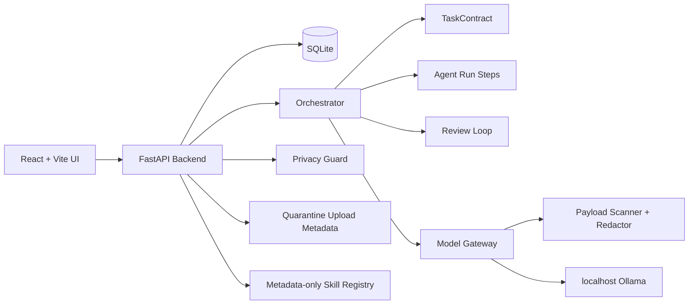

# Architecture

Local Agent Workbench v0.1.0 is a local-first web application for controlled multi-agent workflows.

## Runtime Shape

## Main Components

- `frontend/`: React + Vite + TypeScript UI with Simple Workbench and Advanced Developer Inspector.
- `backend/app/api`: FastAPI routes for workbench, tasks, privacy, files, security, model gateway, and agent runs.
- `backend/app/orchestrator`: task submission, TaskContract creation, local/mock master agent flow, Agent Run coordination.
- `backend/app/model_gateway`: provider records, prompt templates, localhost Ollama checks/calls, invocation review, and invocation logs.
- `backend/app/security`: payload scanning, redaction, privacy classification, local network boundaries, tool permission metadata.
- `backend/app/database`: SQLite table models and service layer.
- `skills/`: metadata-only skill packages. They are discoverable as configuration, but scripts are not executed by v0.1.0.

## Workflow

1. User enters a task in the Simple Workbench.
2. The backend stores the user message and creates or updates a conversation.
3. The orchestrator creates a TaskContract with objective, inputs, outputs, constraints, acceptance criteria, and steps.
4. The Privacy Guard classifies risk and enforces local-only rules.
5. If a local model is selected, Model Gateway reviews the prompt before allowing a localhost Ollama call.
6. Agent Run steps advance through low-risk local execution or safe mock/fallback execution.
7. Deliverables, review results, artifacts, and model invocation metadata are stored in SQLite.
8. The UI shows final output, review summary, and optional developer details.

## Model Gateway Boundary

All model calls must pass through the Model Gateway. v0.1.0 only permits a user-enabled active localhost Ollama provider. Logs keep prompt hash, prompt length, risk level, blocked status, and findings. They do not store full sensitive prompts or full model responses.

## Disabled in v0.1.0

External APIs, web search, MCP execution, desktop automation, OAuth/cookie/CLI token loading, shell execution, uploaded file execution, and automatic uploaded-file parsing are disabled.